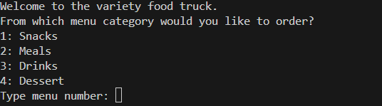
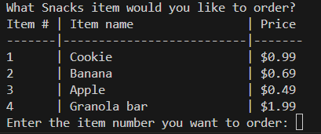
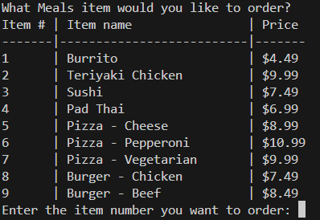
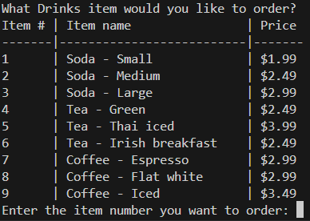
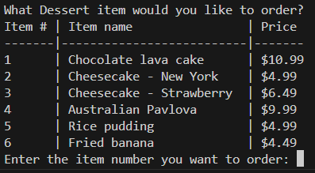
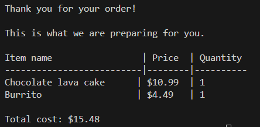

# python-challenge-1
Designing an interactive ordering system from a food truck menu

## Description 
The purpose is to create an interactive ordering system used with a food truck
Custumers will be allowed to place an order based on a selction menu:

Based on the selection you will be presented with another submenu including prices:
 - if Snack:

- if Meals:

- if drinks:

- if Desserts: 

Once the order is completed. The application will provide the final order

